# 📜 목차

1. [서비스 소개](#서비스-소개)
2. [기획 배경](#기획-배경)
3. [개발 환경](#개발-환경)
4. [플레이 방법](#플레이-방법)
5. [화면소개](#-화면-소개)
6. [기술 스택](#-기술-스택)
7. [기술 특이점](#-기술-특이점)
8. [서비스 아키텍처](#-서비스-아키텍처)
9. [팀원 소개](#-팀원-소개)

---

# 🐜 서비스 소개 🐜

## 숨구멍 : 숨바꼭질 게임

## ✨서비스 설명 ✨

### ✨개요 ✨

-   실시간 웹소켓 숨바꼭질게임, **숨구멍**은 캐쥬얼하게 즐길 수 있는 게임입니다.
-   플레이어는 실시간으로 술래와 도망자로 나뉘어 숨바꼭질 게임을 즐길 수 있습니다.
-   술래는 제한 시간 내에 도망자를 찾아야하고, 도망자는 술래를 피해 물체로 변해 숨어야 합니다.

### 🎯 타겟 🎯

-   게임을 좋아하는 모든 사람들

[//]: # '## UCC 🎞️'

# ✨기획 배경 ✨

## 배경

-   **실시간 웹소켓 게임**을 통해 사용자들이 즐길 수 있는 게임을 제공하고자 하였습니다.
-   기존 존재하는 게임에 비해 접근성이 좋고 가볍게 즐길 수 있는 게임을 제공하고자 하였습니다.
-   마우스와 키보드를 사용하여 쉽게 조작할 수 있는 게임을 제공하고자 하였습니다.

## 타 서비스와의 차별성과 특장점 🥅

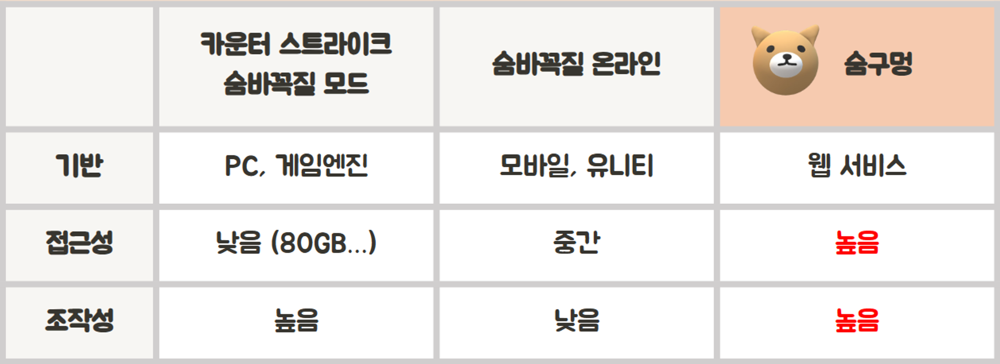

-   PC게임에 비해 설치할 필요가 없어 접근성이 좋습니다.
-   모바일 게임에 비해 더 큰 화면에서 더 좋은 조작감으로 게임을 즐길 수 있습니다.

---

# 🐝 개발 환경 🐝

### Management Tool


### IDE


### Infra


### Frontend


### Backend


### Data


### 그 외

# 🎮 플레이 방법 🎮

## 술래

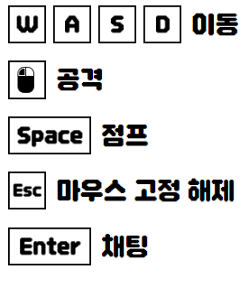

-   술래는 제한 시간 내에 도망자를 찾아야 합니다.
-   술래는 도망자를 찾지 못하면 패배합니다.
-   술래는 도망자를 찾으면 승리합니다.
-   술래는 마우스 좌클릭으로 숨은 플레이어를 조준하여 공격할 수 있습니다.

## 도망자

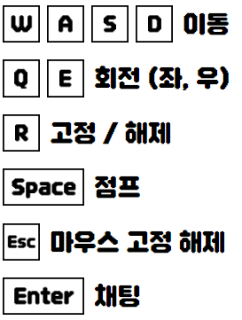

-   도망자는 술래를 피해 물체로 변해 숨어야 합니다.
-   R 버튼으로 물체를 고정한 후 시점을 전환할 수 있습니다.
-   <-, -> 버튼으로 시점을 전환할 수 있습니다.
-   Q, E 버튼으로 물체를 회전할 수 있습니다.

# 🌹 화면 소개

## 1. 메인화면, 로그인, 채널선택

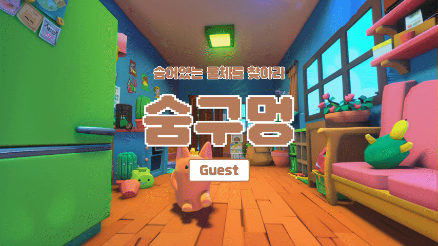

## 2. 방 생성

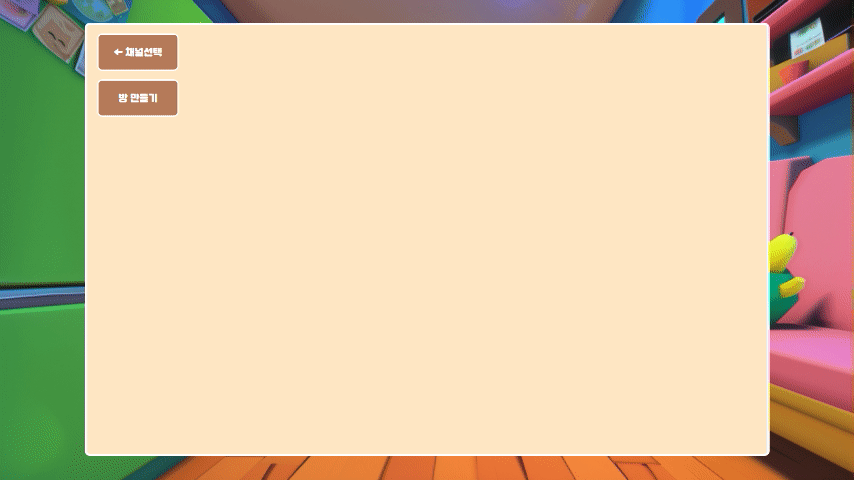

## 3. 공개방 입장

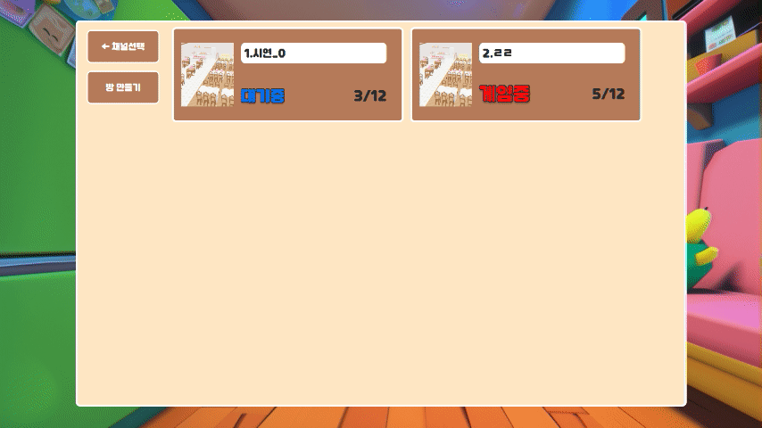

## 4. 비밀방 입장

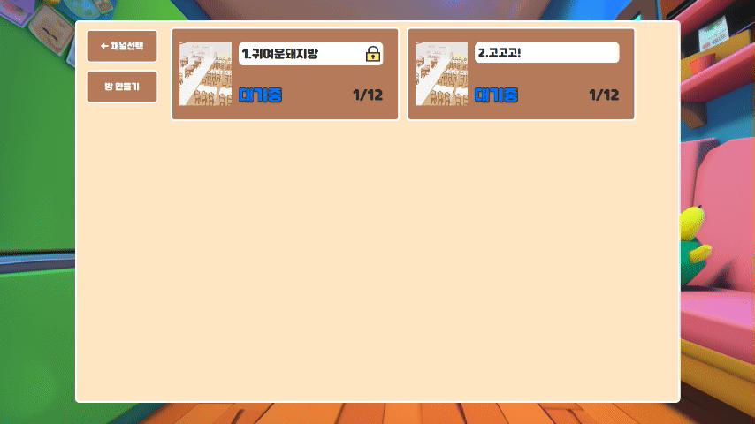

## 5. 술래 시점 - 자유시점


## 6. 술래 시점 - 공격

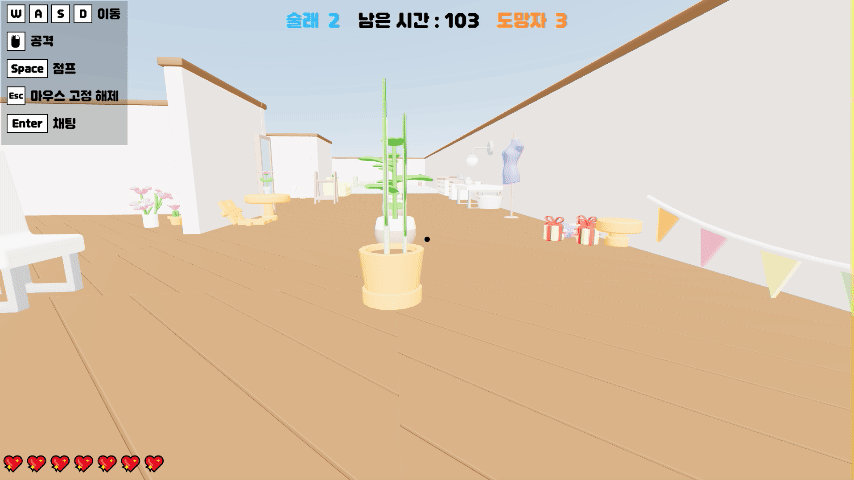

## 7. 도망자 시점 - 선택


## 8. 도망자 시점 - 게임 시작


## 9. 화면 고정 및 다른 사람 시점 보기


## 10. 도망자 승리

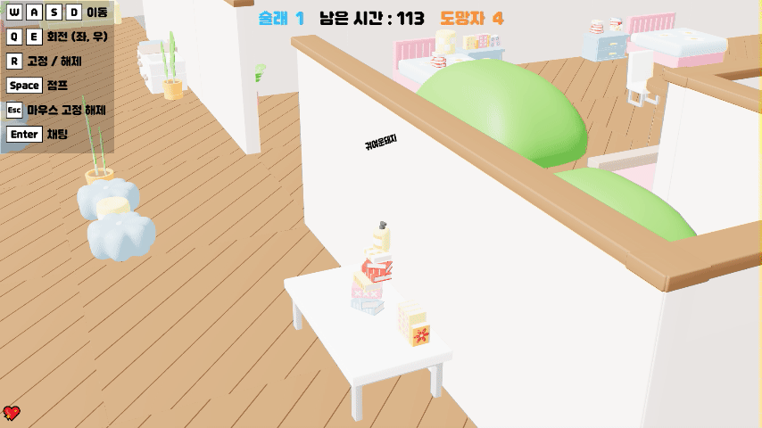

# ✨ 기술 스택 ✨

# FrontEnd

## React

> React는 사용자 인터페이스를 구축하기 위한 JavaScript 라이브러리입니다.
>
> -   **컴포넌트 기반**: React는 컴포넌트 기반 아키텍처를 사용하여 재사용 가능한 UI 컴포넌트를 만들 수 있습니다. 각 컴포넌트는 독립적이며, 재사용과 유지보수가 용이합니다.
> -   **가상 DOM**: React는 가상 DOM(Virtual DOM)을 사용하여 효율적으로 UI를 업데이트합니다. 변경 사항을 가상 DOM에 반영한 후, 실제 DOM과 비교하여 최소한의 변경만 실제 DOM에 적용합니다.
> -   **단방향 데이터 흐름**: React는 단방향 데이터 흐름을 채택하여 데이터가 예측 가능하게 관리됩니다. 이는 상태 관리와 디버깅을 용이하게 합니다.
> -   **생태계**: React는 다양한 라이브러리와 도구로 구성된 풍부한 생태계를 가지고 있습니다. 예를 들어, 상태 관리를 위한 Redux, 라우팅을 위한 React Router 등을 쉽게 통합할 수 있습니다.
> -   **커뮤니티**: React는 강력한 커뮤니티 지원을 받으며, 풍부한 학습 자료와 오픈 소스 프로젝트가 있습니다.
>
> React는 효율적인 UI 개발과 유지보수를 가능하게 하기 때문에 채택하였습니다.

## Redux Toolkit

> Redux Toolkit은 Redux 애플리케이션을 더욱 쉽게 작성하고 유지보수할 수 있게 도와주는 공식 도구 모음입니다. Redux의 핵심 개념을 단순화하고, 설정을 줄이며, 생산성을 높이는 것을 목표로 합니다.
>
> -   **기본 기능**: Redux Toolkit은 `createSlice`, `configureStore` 등의 유틸리티를 제공하여 상태 관리의 복잡성을 줄여줍니다. `createSlice`는 리듀서와 액션을 한번에 정의할 수 있게 하여 코드의 양을 줄이고 가독성을 높입니다.
> -   **미들웨어 관리**: Redux Toolkit은 Redux DevTools와 Redux Thunk를 기본적으로 통합하여, 디버깅과 비동기 작업 관리가 용이합니다. 이를 통해 개발자는 별도의 설정 없이도 강력한 상태 관리 도구를 사용할 수 있습니다.
> -   **성능 최적화**: Immer 라이브러리를 사용하여 불변성을 유지하면서 상태를 변경할 수 있게 해주어 성능을 최적화합니다.
>
> Redux Toolkit은 Redux의 복잡한 상태 관리 로직을 간결하고 명확하게 만들기 때문에 상태관리 라이브러리로 채택하였습니다.

## Three.js

> Three.js는 브라우저에서 3D 그래픽을 쉽게 작성할 수 있게 해주는 JavaScript 라이브러리입니다.
>
> -   **WebGL 지원**: Three.js는 WebGL을 기반으로 하여 복잡한 3D 그래픽을 쉽게 구현할 수 있습니다. 이를 통해 크로스 브라우저 호환성과 높은 성능을 제공합니다.
> -   **풍부한 기능**: Three.js는 다양한 기능을 제공하여 3D 장면을 쉽게 생성하고 조작할 수 있습니다. 예를 들어, 카메라, 조명, 메시, 텍스처, 쉐이더 등을 지원합니다.
> -   **확장성**: Three.js는 플러그인 구조를 가지고 있어, 필요한 기능을 추가하고 확장할 수 있습니다.
> -   **커뮤니티와 자료**: Three.js는 활발한 커뮤니티와 풍부한 자료를 제공하여 학습과 문제 해결을 도와줍니다.
> -   **데모와 예제**: 다양한 데모와 예제가 제공되어, 복잡한 3D 그래픽을 쉽게 시작하고 구현할 수 있습니다.
>
> Three.js는 강력한 3D 그래픽 기능과 확장성을 제공하기 때문에 채택하였습니다.

## React-Three-Fiber

> React Three Fiber는 React를 사용하여 Three.js로 3D 그래픽을 쉽게 작성할 수 있게 해주는 라이브러리입니다.
>
> -   **React 통합**: React Three Fiber는 Three.js를 React의 컴포넌트로 래핑하여 좀 더 직관적이고 유지 보수하기 쉽게 만들어줍니다. React의 상태 관리와 생명주기 메서드를 이용하여 3D 장면을 조작할 수 있습니다.
> -   **디클레러티브 방식**: React Three Fiber는 디클레러티브 방식을 사용하여 3D 장면을 정의합니다. 이를 통해 코드의 가독성과 유지보수성을 높일 수 있습니다.
> -   **호환성**: Three.js의 모든 기능을 지원하며, 기존 Three.js 프로젝트를 React Three Fiber로 쉽게 마이그레이션할 수 있습니다.
> -   **커뮤니티와 자료**: React Three Fiber는 활발한 커뮤니티와 다양한 자료를 제공하여 학습과 개발을 지원합니다.
> -   **플러그인 생태계**: React Three Fiber는 다양한 플러그인을 지원하여 기능을 확장하고, 복잡한 3D 그래픽을 쉽게 구현할 수 있습니다.
>
> React Three Fiber는 React와 Three.js를 통합하여 직관적이고 유지보수하기 쉬운 3D 그래픽 개발을 가능하게 하기 때문에 채택하였습니다.

## React-Three-Cannon

> React Three Cannon은 React Three Fiber와 Cannon.js를 통합하여 3D 물리 시뮬레이션을 쉽게 구현할 수 있게 해주는 라이브러리입니다.
>
> -   **물리 엔진 통합**: React Three Cannon은 Cannon.js 물리 엔진을 사용하여 실제 물리 법칙을 시뮬레이션합니다. 이를 통해 3D 객체 간의 충돌, 중력, 마찰 등을 사실적으로 구현할 수 있습니다.
> -   **React 상태 관리**: React Three Cannon은 React의 상태 관리 시스템을 사용하여 물리 시뮬레이션의 상태를 관리합니다. 이를 통해 복잡한 물리 시뮬레이션을 직관적으로 제어할 수 있습니다.
> -   **성능 최적화**: 효율적인 물리 시뮬레이션을 위해 최적화된 구조를 제공하여 성능을 극대화합니다.
> -   **사용 편의성**: React Three Cannon은 간단하고 직관적인 API를 제공하여 물리 시뮬레이션을 쉽게 시작하고 구현할 수 있습니다.
>
> React Three Cannon은 3D 물리 시뮬레이션을 쉽게 구현하고 관리할 수 있기 때문에 채택하였습니다.

## React-Three-Drei

> React Three Drei는 React Three Fiber를 위한 유틸리티 라이브러리로, 3D 그래픽 개발을 더욱 쉽게 만들어줍니다.
>
> -   **유틸리티 컴포넌트**: React Three Drei는 다양한 유틸리티 컴포넌트를 제공하여 3D 그래픽 개발을 단순화합니다. 예를 들어, 카메라 컨트롤, 조명, 텍스처 로더 등을 제공합니다.
> -   **커스텀 훅**: React Three Drei는 다양한 커스텀 훅을 제공하여 복잡한 3D 로직을 쉽게 구현할 수 있습니다. 예를 들어, 애니메이션, 반응형 레이아웃, 상호작용 등을 구현할 수 있습니다.
> -   **호환성**: React Three Drei는 React Three Fiber와 완벽하게 호환되며, 기존 프로젝트에 쉽게 통합할 수 있습니다.
> -   **성능 최적화**: React Three Drei는 성능을 최적화한 컴포넌트와 훅을 제공하여, 3D 그래픽의 렌더링 성능을 극대화합니다.
> -   **커뮤니티와 자료**: React Three Drei는 활발한 커뮤니티와 다양한 자료를 제공하여 학습과 개발을 지원합니다.
>
> React Three Drei는 다양한 유틸리티와 커스텀 훅을 제공하여 3D 그래픽 개발을 단순화하고 효율적으로 만들고 특히 성능 최적화와 렌더링 성능을 측정하고 적용시키기 편하기 때문에 채택하였습니다.

## TypeScript

> TypeScript는 JavaScript의 상위 집합으로, 정적 타입을 추가하여 코드의 품질과 개발 생산성을 향상시키는 데 도움을 줍니다.
>
> -   **정적 타입 검사**: TypeScript는 코드 작성 시점에 타입 오류를 잡아주어 런타임 오류를 줄여줍니다. 이를 통해 코드의 안정성과 신뢰성을 높일 수 있습니다.
> -   **IDE 통합**: TypeScript는 주요 IDE와 에디터에서 강력한 코드 완성, 네비게이션, 리팩토링 기능을 지원합니다. 이는 개발 생산성을 크게 향상시킵니다.
> -   **모던 JavaScript 지원**: TypeScript는 최신 ECMAScript 기능을 지원하며, 트랜스파일러로서 구형 브라우저와의 호환성을 유지할 수 있게 해줍니다.
> -   **대규모 프로젝트**: 타입 시스템을 통해 코드 구조를 명확하게 정의하고 유지보수성을 높여주기 때문에 대규모 프로젝트에 적합합니다.
>
> 코드의 안전성과 유지보수성을 향상시키기 때문에 채택하였습니다.

## Axios

> Axios는 브라우저와 Node.js를 위한 Promise 기반 HTTP 클라이언트입니다.
>
> -   **간편한 API**: Axios는 직관적인 메서드(`axios.get`, `axios.post` 등)를 제공하여 HTTP 요청을 쉽게 작성할 수 있습니다.
> -   **자동 변환**: JSON 데이터의 자동 변환 기능을 제공하여 응답 데이터를 쉽게 처리할 수 있습니다.
> -   **인터셉터**: 요청과 응답 인터셉터를 통해 HTTP 요청 전후에 추가 로직을 삽입할 수 있습니다. 이를 통해 인증 토큰 처리나 로딩 상태 관리 등을 손쉽게 구현할 수 있습니다.
> -   **취소 토큰**: 요청 취소 기능을 제공하여 필요 없는 네트워크 요청을 중단할 수 있습니다.
> -   **타임아웃 설정**: 요청 타임아웃을 설정하여 네트워크 지연으로 인한 문제를 방지할 수 있습니다.
>
> 직관적이고 간편한 HTTP 요청 처리를 위해 채택하였습니다.

## Vite

> Vite는 빠르고 간단한 빌드 도구로, 현대적인 프론트엔드 개발 환경을 제공합니다.
>
> -   **빠른 개발 서버**: Vite는 기본적으로 ES 모듈을 사용하여 브라우저가 코드를 직접 해석하고 실행할 수 있게 하여 개발 서버를 매우 빠르게 시작할 수 있습니다.
> -   **HMR(Hot Module Replacement)**: 코드 변경 사항을 즉시 반영하여 개발 중 피드백 루프를 빠르게 가져갈 수 있습니다. 이는 개발자의 생산성을 크게 향상시킵니다.
> -   **최적화된 빌드**: Rollup을 기반으로 한 번들러를 사용하여 프로덕션 빌드를 최적화합니다. 이를 통해 작은 번들 크기와 빠른 로딩 속도를 제공합니다.
> -   **플러그인 생태계**: Vite는 풍부한 플러그인 생태계를 지원하여 다양한 기능을 손쉽게 확장할 수 있습니다.
> -   **사용 편의성**: 설정이 간단하고 직관적이며, 기존 프로젝트에 쉽게 통합할 수 있습니다.
>
> 빠른 개발 환경 설정과 효율적인 빌드 프로세스를 위해 채택하였습니다.

## StompJS

> StompJS는 STOMP (Simple Text Oriented Messaging Protocol) 프로토콜을 사용하는 메시지 브로커와의 통신을 쉽게 만들어주는 자바스크립트 라이브러리입니다.
>
> -   **WebSocket 지원**: STOMP 프로토콜을 사용하여 WebSocket 연결을 통해 실시간 양방향 통신을 구현할 수 있습니다.
> -   **구독/발행 모델**: 주로 채팅 애플리케이션, 실시간 알림 시스템 등에서 사용되며, 구독/발행 모델을 통해 메시지를 효율적으로 전달할 수 있습니다.
> -   **간단한 API**: StompJS는 간단하고 직관적인 API를 제공하여 WebSocket 연결을 쉽게 설정하고 메시지를 주고받을 수 있습니다.
> -   **다양한 브로커 지원**: RabbitMQ, ActiveMQ 등 다양한 메시지 브로커와 호환됩니다.
> -   **재연결 로직**: 연결이 끊어졌을 때 자동으로 재연결을 시도하는 기능을 제공하여 안정적인 통신을 보장합니다.
>
> 실시간 통신을 쉽게 구현하기 위해 채택하였습니다.

## TailwindCSS

> TailwindCSS는 유틸리티 클래스 기반의 CSS 프레임워크로, 스타일링을 쉽게하고 생산성을 높여줍니다.
>
> -   **유틸리티 클래스**: 미리 정의된 유틸리티 클래스를 통해 빠르고 일관성 있게 스타일을 적용할 수 있습니다. 예를 들어, `flex`, `p-4`, `text-center`와 같은 클래스를 사용하여 CSS를 직접 작성하지 않고도 스타일을 지정할 수 있습니다.
> -   **반응형 디자인**: TailwindCSS는 반응형 디자인을 지원하여 다양한 디바이스 크기에 맞춰 스타일을 쉽게 조정할 수 있습니다.
> -   **커스터마이징**: TailwindCSS는 설정 파일을 통해 쉽게 커스터마이징할 수 있어, 프로젝트의 디자인 요구사항에 맞게 프레임워크를 조정할 수 있습니다.
> -   **재사용성**: 유틸리티 클래스 기반의 접근 방식은 코드 재사용성을 높여주며, 유지보수를 용이하게 합니다.
> -   **성능 최적화**: 사용되지 않는 CSS를 제거하는 PurgeCSS와 통합하여 최종 빌드 크기를 최소화합니다.
>
> 빠르고 효율적인 스타일링을 위해 채택하였습니다.

# BackEnd

## WebRTC

### WebRTC란?

> WebRTC (Web Real-Time Communication)는 웹 브라우저 간에 플러그인의
> 도움 없이 서로 통신할 수 있도록 설계된 API 입니다. 음성 통화, 영상 통화,
> P2P 파일 공유 등으로 활용될 수 있습니다.

## Web Socket


> Websocket이란 ws 프로토콜을 기반으로 클라이언트와 서버 사이에 지속적인 양방향 연결 스트림을 만들어주는 기술입니다. 이는 stateless한 성질을 가지는 HTTP 일부 통신의 한계를 극복해 주는 것으로 서버는 클라이언트에 데이터를 실시간으로 전달할 수 있게 됩니다.

### 적용

-   게임 서비스 실시간 통신을 통한 채팅 기능
-   게임 로직 진행을 위한 실시간 통신
-   플레이어 위치 정보 실시간 전달을 통한 게임 진행

## Spring Boot

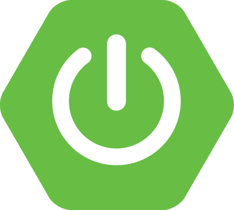

> Spring Boot는 Spring 프레임워크를 사용하여 Java 어플리케이션을 빠르게 개발할 수 있도록 도와주는 프레임워크입니다.
>
> Spring Boot는 Spring 프레임워크의 설정을 자동화하여 개발자가 빠르게 개발할 수 있도록 도와줍니다.

### 적용

-   게임 서버 구축
-   게임 로직 구현
-   게임 서버와 클라이언트 간 통신

# Infra & DevOps

## Kubernetes


### Kubernetes란?

> Kubernetes는 컨테이너화된 애플리케이션을 자동으로 배포, 스케일링, 관리하는 오픈소스 플랫폼입니다.
>
> Kubernetes는 컨테이너화된 애플리케이션을 배포하고 관리하는데 사용됩니다.
>
> Kubernetes는 컨테이너화된 애플리케이션을 스케일링하고 관리하는데 사용됩니다.

### 적용

-   **배포 환경 구축**

    Kubernetes를 사용하여 배포 환경을 구축하였습니다.

-   **스케일링**

    Kubernetes를 사용하여 스케일링을 구현하였습니다.

### argoCD

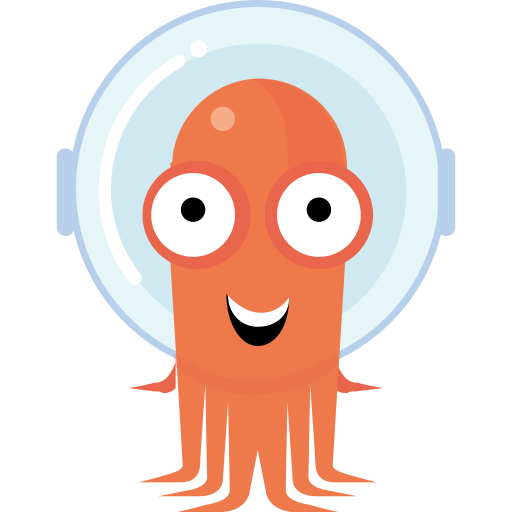

> ArgoCD는 GitOps를 구현하기 위한 오픈소스 도구입니다.
>
> ArgoCD는 Kubernetes 클러스터에 배포된 애플리케이션을 Git 저장소에 저장된 YAML 파일로 관리할 수 있습니다.

### 적용

-   **CI/CD 파이프라인 구축**  
    ArgoCD를 사용하여 CI/CD 파이프라인을 구축하였습니다.

## Docker


> Docker는 컨테이너 기반의 오픈소스 가상화 플랫폼입니다.
>
> Docker를 사용하면 개발자는 어플리케이션을 빌드, 배포, 실행할 수 있습니다.
>
> Docker는 리눅스 컨테이너를 사용하여 어플리케이션을 패키징하고 실행하는데 사용됩니다.
>
> Docker는 어플리케이션을 더 빠르게 배포할 수 있게 해주고, 어플리케이션을 실행하는 환경을 일관되게 유지할 수 있습니다.

### 적용

-   **개발 환경 구축**  
    개발 환경을 구축하기 위해 사용하였습니다.
-   **배포 환경 구축**
    배포 환경을 구축하기 위해 사용하였습니다.

## Jenkins


> Jenkins는 오픈소스 자동화 서버입니다.
>
> Jenkins는 빌드, 테스트, 배포 등의 작업을 자동화할 수 있습니다.
>

### 적용

-   **CI/CD 파이프라인 구축**
-   **배포 환경 구축**

## ELK, Kafka

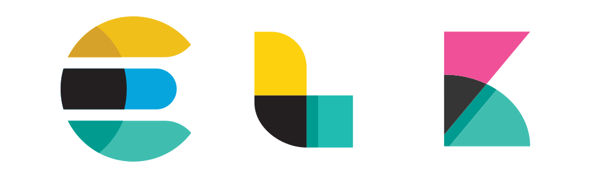 

> ELK는 Elasticsearch, Logstash, Kibana의 약자로, 데이터 수집, 검색, 분석, 시각화를 위한 오픈소스 도구입니다.
>
> Kafka는 분산 스트리밍 플랫폼으로, 대용량의 데이터를 실시간으로 처리할 수 있습니다.

### 적용

-   **로그 수집 및 분석**  
    ELK와 Kafka를 사용하여 로그 수집 및 분석을 구현하였습니다.

```
ELK + Kafka를 함께 사용한 이유

ElasticSearch에 로그를 직접 수집할 수 있지만

Kafka를 추가 한 이유는 우리 프로젝트가 분산 서버를 사용하므로

과도한 트래픽이 몰렸을 경우 ELK 스택의 문제로 인해 로그가 손실되지 않도록

Kafka를 ELK 앞단에 추가함

ELK 스택의 문제: 들어오는 데이터의 급증으로 인해 Elasticsearch가 용량 제한에 도달하면 데이터 손실 위험이 있음. Elasticsearch가 신속하게 데이터를 인덱싱할 수 없으면 새 데이터를 거부할 수 있음. 그러므로 Kafka와 같은 버퍼를 두어 Elasticsearch가 데이터를 처리할 준비가 될 때까지 데이터를 보관할 수 있는 중간 저장소가 역할을 하도록함
```
## k6
> k6는 오픈소스로 제공되는 성능 테스트 도구입니다.
> 
> k6를 사용하면 웹사이트나 API의 성능을 측정하고, 부하 테스트를 수행할 수 있습니다.
> 

### 적용


- **부하 테스트**
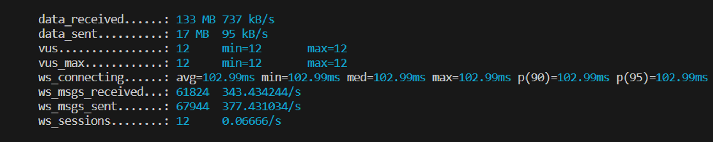
    - 한 게임에 12명 쉬지않고 움직일 시 2분30초동안 서버로 약 17MB (95KB/s) 전송, 서버에서 유저들에게  133MB (737KB/s) 전송하는 부하가 발생
    - 결과: <span style="color:red">**400명**</span>의 유저가 웹소켓 연결후 게임을 진행하면 EC2서버의 CPU 사용률이 90% 초과
    - EC2 spec : c5.2xlarge - 4cpu, 16GB RAM
# 🐴 서비스 아키텍처

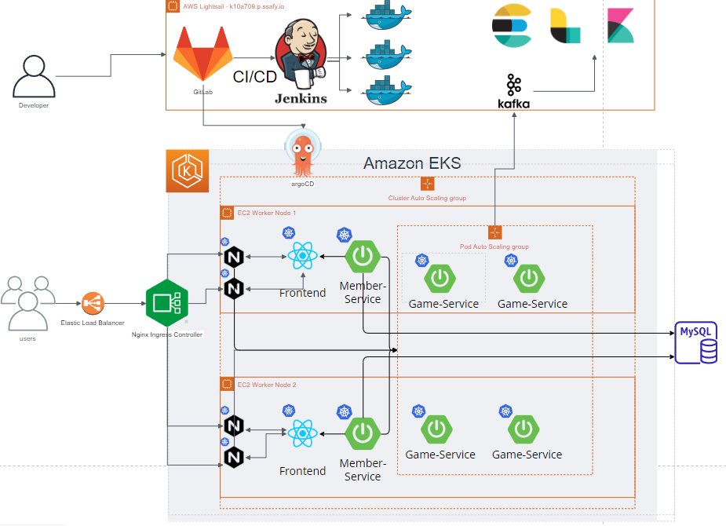

# 🐝 팀원 소개 🐝

| 이름   | 역할       | Git                                                                                                                                     |
| ------ | ---------- | --------------------------------------------------------------------------------------------------------------------------------------- |
| 이제헌 | 인프라     | [ <br/> @JEGHTNER](https://github.com/JEGHTNER)          |
| 최창호 | 인프라     | [ <br/> @Changho0514](https://github.com/Changho0514) |
| 김종범 | 백엔드     | [ <br/> @jongbum97](https://github.com/jongbum97)       |
| 최자영 | 백엔드     | [ <br/> @jayoung977](https://github.com/jayoung977)    |
| 지준영 | 프론트엔드 | [ <br/> @JunJI97](https://github.com/JunJI97)             |
| 정은수 | 프론트엔드 | [ <br/> @pigggulggul](https://github.com/pigggulggul) |
