# 목차
- [EKS CLUSTER 구축](#eks-cluster-구축)
  - [kubectl 설치](#kubectl-설치)
  - [IAM Authenticator 설치](#iam-authenticator-설치)
  - [awscli 설치](#awscli-설치)
  - [eksctl 설치](#eksctl-설치)
  - [kubeconfig 생성](#kubeconfig-생성)
  - [EKS role, IAM 설정](#eks-role-iam-설정)
  - [EKS Woker Node 설정](#eks-woker-node-설정)
- [Helm 설치](#helm-설치)
- [HTTPS 인증 (CertManager)](#https-인증-certmanager)
- [argocd 설치](#argocd-설치)
- [Nginx Ingress Controller 설치](#nginx-ingress-controller-설치)
- [프로젝트 배포](#프로젝트-배포)
- [프로젝트 구조](#프로젝트-구조)
- [kube-manifest](#kube-manifest)


# 포팅 가이드라인

이 문서는 `숨구멍` 서비스  `Infra`, `k8s`의 빌드 및 배포를 위한 문서입니다.

# 프로젝트 버전 정보

| 공통     | 형상관리          | Gitlab                | -      |
| -------- |---------------|-----------------------|--------|
| Infra    | AWS-EC2       | Ubuntu                | 20.04.6 |
|          | CI/CD         | docker                | 25.0.0 |
|          |               | docker-compose        | 2.21.0 |
|          |               | kubectl               | 1.29.0 |
|          |               | eksctl                | 0.70.0 |
|          |               | aws-iam-authenticator | 1.29.0 |
|          |               | awscli                | 2.2.47 |
|          |               | argocd                | 2.1.3  |
|          |               | helm                  | 3.7.0  |
|          |               | cert-manager          | 1.9.1  |

---

# EKS CLUSTER 구축
## kubectl 설치 
- kubectl은 쿠버네티스 클러스터와 통신하기 위한 CLI 도구이다.
```bash
curl -LO "https://dl.k8s.io/release/v1.29.0/bin/linux/amd64/kubectl"
chmod +x ./kubectl
mkdir -p $HOME/bin && cp ./kubectl $HOME/bin/kubectl && export PATH=$HOME/bin:$PATH
echo 'export PATH=$HOME/bin:$PATH' >> ~/.bashrc
kubectl version --short --client
```

## IAM Authenticator 설치
- IAM Authenticator는 AWS IAM을 사용하여 쿠버네티스 클러스터에 인증하는 도구이다.
```bash
curl -o aws-iam-authenticator https://amazon-eks.s3-us-west-2.amazonaws.com/1.14.6/2019-08-22/bin/linux/amd64/aws-iam-authenticator
chmod +x ./aws-iam-authenticator
mkdir -p $HOME/bin && cp ./aws-iam-authenticator $HOME/bin/aws-iam-authenticator && export PATH=$HOME/bin:$PATH
echo 'export PATH=$HOME/bin:$PATH' >> ~/.bashrc
aws-iam-authenticator help
```

## awscli 설치
- AWS CLI는 AWS 서비스와 상호 작용하기 위한 명령줄 도구이다.
```bash
sudo apt-get update
#sudo apt-get install awscli

# Download AWS CLI v2
curl "https://awscli.amazonaws.com/awscli-exe-linux-x86_64.zip" -o "awscliv2.zip"

# Un-compress the archive
unzip awscliv2.zip

# Run the installer
sudo ./aws/install
```

## eksctl 설치
- eksctl은 EKS 클러스터를 쉽게 생성하고 관리할 수 있는 도구이다.
```shell
curl --silent --location "https://github.com/weaveworks/eksctl/releases/latest/download/eksctl_$(uname -s)_amd64.tar.gz" | tar xz -C /tmp
sudo mv /tmp/eksctl /usr/local/bin
eksctl version
```
## kubeconfig 생성
- AWS CLI를 사용하여 EKS 클러스터에 대한 kubeconfig 파일을 생성한다.
```shell
IAM 사용자
아이디 : k709manager
비번 : tnaqkRhrwlf!

aws configure

ubuntu@ip-172-26-2-185:~$ aws configure
AWS Access Key ID [****************wlf!]: { AWS_ACCESS_KEY_ID }
AWS Secret Access Key [None]: { AWS_SECRET_ACCESS_KEY }
Default region name [None]: ap-northeast-2 # 서울
Default output format [None]:

aws sts get-caller-identity
aws eks --region ap-northeast-2 update-kubeconfig --name EKS-CLUSTER
export KUBECONFIG=/home/ubuntu/.kube/config
kubectl get svc
```
## EKS role, IAM 설정
- EKS 클러스터를 생성하기 위한 IAM 역할을 생성하고, 워커 노드에 할당할 IAM 역할을 생성한다.
```shell
cat > eks-cluster-role.json << EOF
{
	"Version": "2012-10-17",
	"Statement": [
		{
			"Effect": "Allow",
			"Principal": {
				"Service": "eks.amazonaws.com"
			},
			"Action": "sts:AssumeRole"
		}
	]
}
EOF
aws iam create-role --role-name eks-cluster-role --assume-role-policy-document file://eks-cluster-role.json
aws iam attach-role-policy --role-name eks-cluster-role --policy-arn arn:aws:iam::aws:policy/AmazonEKSClusterPolicy
aws iam attach-role-policy --role-name eks-cluster-role --policy-arn arn:aws:iam::aws:policy/AmazonEKSServicePolicy
```

```shell
cat > eks-worker-role.json << EOF
{
    "Version": "2012-10-17",
    "Statement": [
        {
            "Effect": "Allow",
            "Principal": {
                "Service": "ec2.amazonaws.com"
            },
            "Action": "sts:AssumeRole"
        }
    ]
}
EOF
aws iam create-role --role-name eks-worker-role --assume-role-policy-document file://eks-worker-role.json
aws iam attach-role-policy --role-name eks-worker-role --policy-arn arn:aws:iam::aws:policy/AmazonEKSWorkerNodePolicy
aws iam attach-role-policy --role-name eks-worker-role --policy-arn arn:aws:iam::aws:policy/AmazonEC2ContainerRegistryReadOnly
aws iam attach-role-policy --role-name eks-worker-role --policy-arn arn:aws:iam::aws:policy/CloudWatchLogsFullAccess
aws iam attach-role-policy --role-name eks-worker-role --policy-arn arn:aws:iam::aws:policy/AmazonEKS_CNI_Policy
aws iam attach-role-policy --role-name eks-worker-role --policy-arn arn:aws:iam::aws:policy/AmazonRoute53FullAccess
```
```shell
cat > EKSAutoscailerPolicy.json << EOF
{
    "Version": "2012-10-17",
    "Statement": [
        {
            "Action": [
                "autoscaling:DescribeAutoScalingGroups",
                "autoscaling:DescribeAutoScalingInstances",
                "autoscaling:DescribeLaunchConfigurations",
                "autoscaling:DescribeTags",
                "autoscaling:SetDesiredCapacity",
                "autoscaling:TerminateInstanceInAutoScalingGroup",
                "ec2:DescribeLaunchTemplateVersions"
            ],
            "Resource": "*",
            "Effect": "Allow"
        }
    ]
}
EOF
aws iam create-policy --policy-name EKSAutoscailerPolicy --policy-document file://EKSAutoscailerPolicy.json
aws iam attach-role-policy --role-name eks-worker-role --policy-arn arn:aws:iam::590183956136:policy/EKSAutoscailerPolicy
```
```shell
cat > ALBIngressControllerPolicy.json <<EOF
{
    "Version": "2012-10-17",
    "Statement": [
        {
            "Effect": "Allow",
            "Action": [
                "acm:DescribeCertificate",
                "acm:ListCertificates",
                "acm:GetCertificate"
            ],
            "Resource": "*"
        },
        {
            "Effect": "Allow",
            "Action": [
                "ec2:AuthorizeSecurityGroupIngress",
                "ec2:CreateSecurityGroup",
                "ec2:CreateTags",
                "ec2:DeleteTags",
                "ec2:DeleteSecurityGroup",
                "ec2:DescribeAccountAttributes",
                "ec2:DescribeAddresses",
                "ec2:DescribeInstances",
                "ec2:DescribeInstanceStatus",
                "ec2:DescribeInternetGateways",
                "ec2:DescribeNetworkInterfaces",
                "ec2:DescribeSecurityGroups",
                "ec2:DescribeSubnets",
                "ec2:DescribeTags",
                "ec2:DescribeVpcs",
                "ec2:ModifyInstanceAttribute",
                "ec2:ModifyNetworkInterfaceAttribute",
                "ec2:RevokeSecurityGroupIngress"
            ],
            "Resource": "*"
        },
        {
            "Effect": "Allow",
            "Action": [
                "elasticloadbalancing:AddListenerCertificates",
                "elasticloadbalancing:AddTags",
                "elasticloadbalancing:CreateListener",
                "elasticloadbalancing:CreateLoadBalancer",
                "elasticloadbalancing:CreateRule",
                "elasticloadbalancing:CreateTargetGroup",
                "elasticloadbalancing:DeleteListener",
                "elasticloadbalancing:DeleteLoadBalancer",
                "elasticloadbalancing:DeleteRule",
                "elasticloadbalancing:DeleteTargetGroup",
                "elasticloadbalancing:DeregisterTargets",
                "elasticloadbalancing:DescribeListenerCertificates",
                "elasticloadbalancing:DescribeListeners",
                "elasticloadbalancing:DescribeLoadBalancers",
                "elasticloadbalancing:DescribeLoadBalancerAttributes",
                "elasticloadbalancing:DescribeRules",
                "elasticloadbalancing:DescribeSSLPolicies",
                "elasticloadbalancing:DescribeTags",
                "elasticloadbalancing:DescribeTargetGroups",
                "elasticloadbalancing:DescribeTargetGroupAttributes",
                "elasticloadbalancing:DescribeTargetHealth",
                "elasticloadbalancing:ModifyListener",
                "elasticloadbalancing:ModifyLoadBalancerAttributes",
                "elasticloadbalancing:ModifyRule",
                "elasticloadbalancing:ModifyTargetGroup",
                "elasticloadbalancing:ModifyTargetGroupAttributes",
                "elasticloadbalancing:RegisterTargets",
                "elasticloadbalancing:RemoveListenerCertificates",
                "elasticloadbalancing:RemoveTags",
                "elasticloadbalancing:SetIpAddressType",
                "elasticloadbalancing:SetSecurityGroups",
                "elasticloadbalancing:SetSubnets",
                "elasticloadbalancing:SetWebACL"
            ],
            "Resource": "*"
        },
        {
            "Effect": "Allow",
            "Action": [
                "iam:CreateServiceLinkedRole",
                "iam:GetServerCertificate",
                "iam:ListServerCertificates"
            ],
            "Resource": "*"
        },
        {
            "Effect": "Allow",
            "Action": [
                "cognito-idp:DescribeUserPoolClient"
            ],
            "Resource": "*"
        },
        {
            "Effect": "Allow",
            "Action": [
                "waf-regional:GetWebACLForResource",
                "waf-regional:GetWebACL",
                "waf-regional:AssociateWebACL",
                "waf-regional:DisassociateWebACL"
            ],
            "Resource": "*"
        },
        {
            "Effect": "Allow",
            "Action": [
                "tag:GetResources",
                "tag:TagResources"
            ],
            "Resource": "*"
        },
        {
            "Effect": "Allow",
            "Action": [
                "waf:GetWebACL"
            ],
            "Resource": "*"
        }
    ]
}
EOF

aws iam create-policy --policy-name ALBIngressControllerPolicy --policy-document file://ALBIngressControllerPolicy.json
aws iam attach-role-policy --role-name eks-worker-role --policy-arn arn:aws:iam::590183956136:policy/ALBIngressControllerPolicy
```
# EKS Woker Node 설정
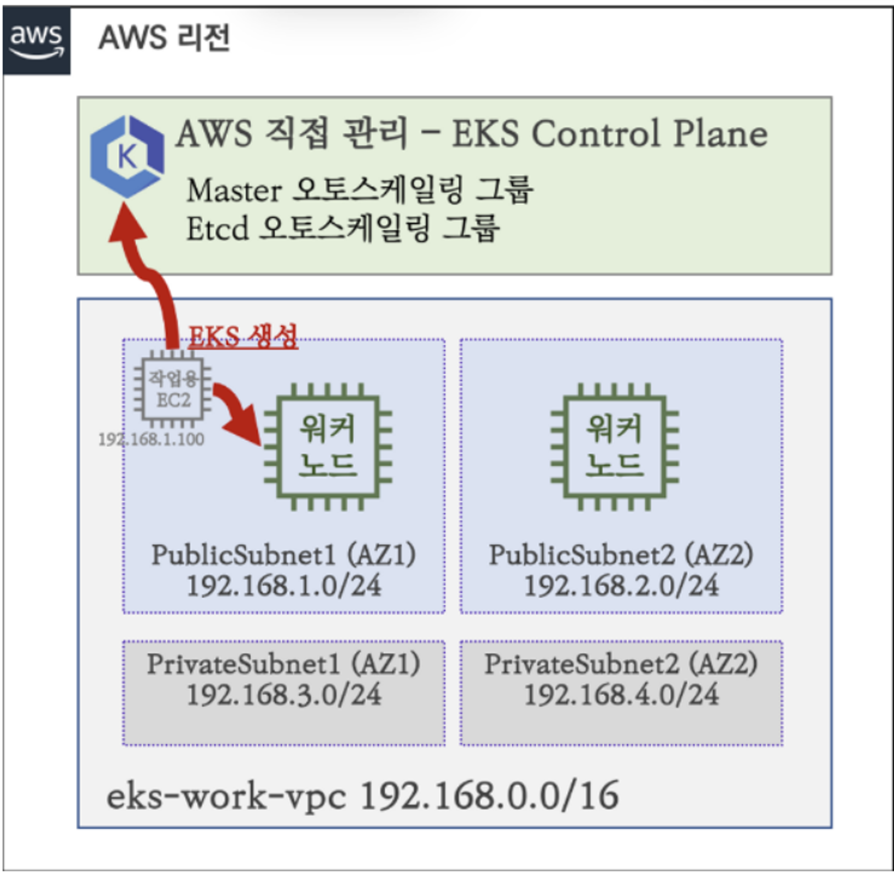
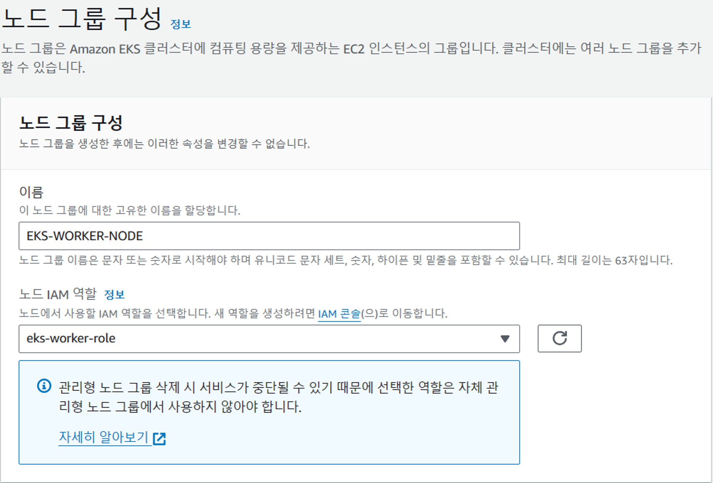
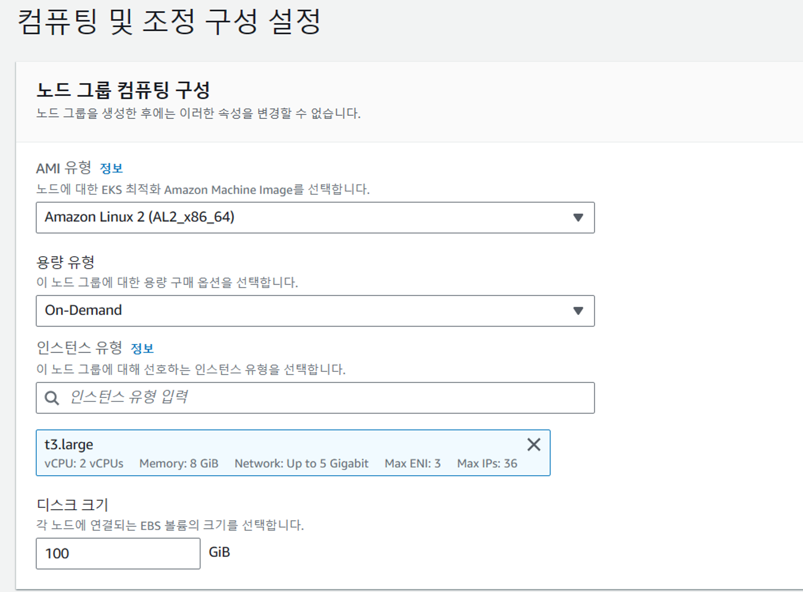
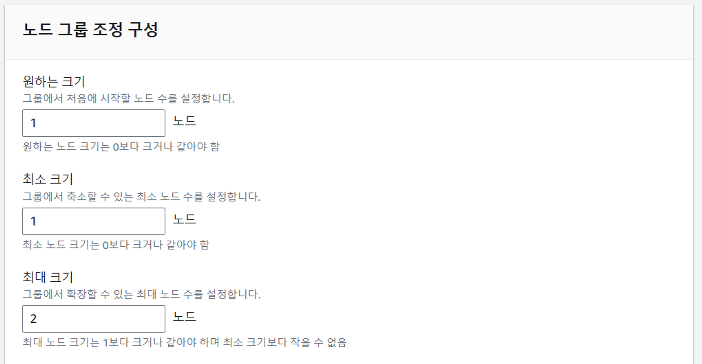
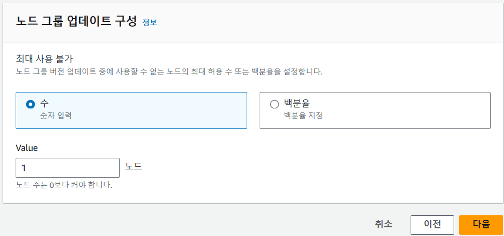
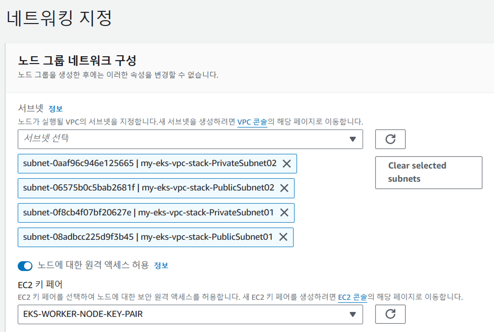
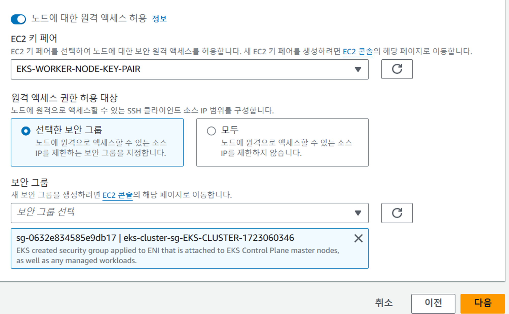
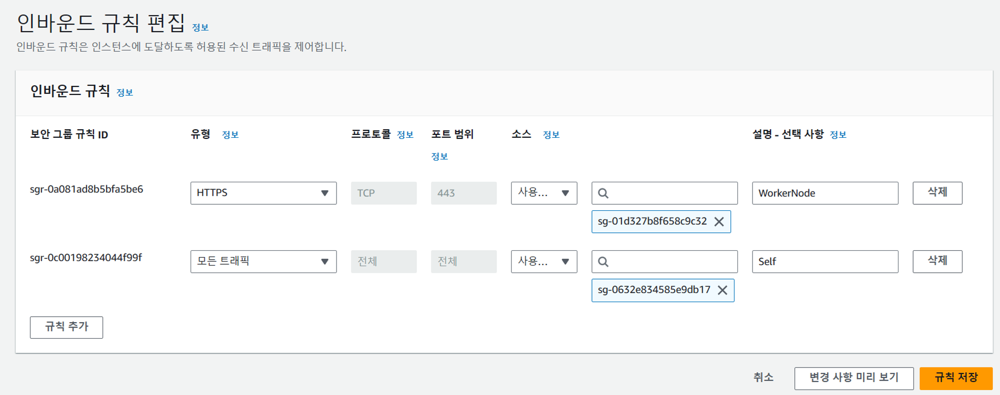
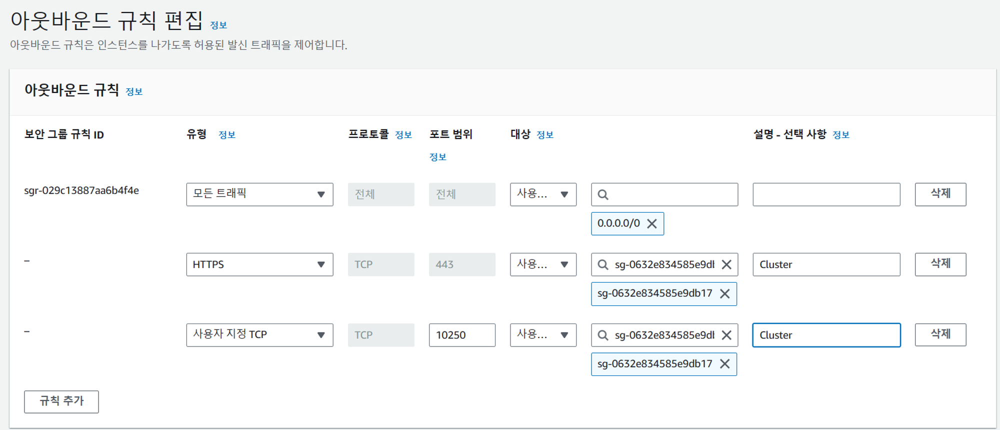

# Helm 설치
- Helm은 쿠버네티스의 패키지 매니저로, 쿠버네티스 애플리케이션을 손쉽게 배포하고 관리할 수 있도록 도와준다.
```shell
curl https://raw.githubusercontent.com/helm/helm/master/scripts/get-helm-3 > get_helm.sh
chmod 700 get_helm.sh
./get_helm.sh

helm repo add stable "https://charts.helm.sh/stable"
helm search repo stable
helm repo update

## helm 자동완성 
helm completion bash >> ~/.bash_completion
. /etc/profile.d/bash_completion.sh
. ~/.bash_completion
source <(helm completion bash)

```

# HTTPS 인증 (CertManager)
- cert-manager는 쿠버네티스 클러스터 내에서 인증기관에게 인증서를 만들어 줄 것을 요청하고, 인증기관의 challenge에 응답하는 역할을 수행한다.
## 적용 순서

1.개인 dns 발행 (가비아 사용) → hidebowwow.site
2. [hidebowwow.site](http://hidebowwow.site) 의 NS를 cloudflare ns로 변경
    - kolton.ns.cloudflare.com
    - mina.ns.cloudflare.com
3. cloudflare의 토큰을 발급
4. cloudflare-api-token-secret 을 k8s에 저장 (apply -f cloudflare-api-token.yaml)
5. cluster-issuer등록 (apply -f cluster-issuer-prod.yaml)
6. certificate 발급 (apply -f certificate.yaml)
    - 발급과정
        - kubectl get certificate
        - kubectl get certificaterequest
        - kubectl get order
        - kubectl get challenge
      
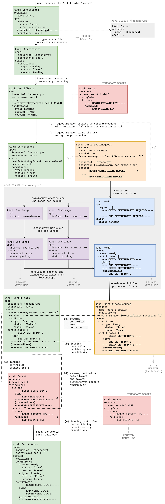

```shell
helm repo add jetstack https://charts.jetstack.io
helm repo update
# cert-manager라는 이름으로 cert-manager 설치
helm install cert-manager jetstack/cert-manager --namespace cert-manager --create-namespace --version v1.9.1  --set installCRDs=true --set 'extraArgs={--dns01-recursive-nameservers-only,--dns01-recursive-nameservers=8.8.8.8:53\,1.1.1.1:53}'
```
```shell
#cloudflare-api-token.yaml
apiVersion: v1
kind: Secret
metadata:
  name: cloudflare-api-token-secret
  namespace: cert-manager
type: Opaque
stringData:
  api-token: {cloudflare-api-token} # ex) _reX7iwfn7gup4luidCkAiAPczZNxG7hOzHGXXXX

# 공개토큰으로 작동이 안돼서 cloudflare에서 커스텀 토큰을 따로 만들어줬음
```
```shell
#certificate.yaml
apiVersion: cert-manager.io/v1
kind: Certificate
metadata:
  name: hidebowwow-cert
spec:
  secretName: hidebowwow-cert
  issuerRef:
    name: k709-prod
    kind: ClusterIssuer
  commonName: 'hidebowwow.site'
  dnsNames:
  - hidebowwow.site
```
```shell
#cluster-issuer-prod.yaml
apiVersion: cert-manager.io/v1
kind: ClusterIssuer
metadata:
  name: k709-prod
spec:
  acme:
    # The ACME server URL
    server: https://acme-v02.api.letsencrypt.org/directory
    # Email address used for ACME registration
    email: jeghtner@gmail.com
    # Name of a secret used to store the ACME account private key
    privateKeySecretRef:
      name: letsencrypt-prod
    # Enable the challenge provider
    solvers:
      - dns01:
          cloudflare:
            email: jeghtner@gmail.com
            apiTokenSecretRef:
              name: cloudflare-api-token-secret
              key: api-token
```
> cert-manager는 쿠버네티스 클러스터 내에서 인증기관에게 인증서를 만들어 줄 것을 요청하고, 인증기관의 challenge에 응답하는 역할을 수행한다. 
> challenge는 쉽게 말해, 인증기관에서 당신이 DNS name의 주인인지를 파악하는 과정이라고 생각하면 된다. `example.com`에 대한 SSL(TLS) 인증서를 발급받기 위해, `example.com` 도메인이 내 것인지를 확인하는 과정이다. 대표적으로 HTTP-01 타입의 challenge가 있는데, 인증기관에서 어떤 토큰을 주면 우리는 이를 `http://<YOUR_DOMAIN>/.well-known/acme-challenge/<TOKEN>` url에서 가져갈 수 있게 파일을 업로드하는 형식이다. 인증기관이 성공적으로 해당 파일에 접근할 수 있다면, 해당 도메인이 우리 것이라는 것을 확인하는 식이다.

```shell
# 진행과정 확인
kubectl get certificate
kubectl get certificaterequest
kubectl get order
kubectl get challenge
```
이 다음에는 어떤 인증기관에다가 인증서 생성을 요청해야할지 정의하면 된다. `cert-manager`는 내부적으로 CRD 리소스인 `Issuer`를 사용하는데, 이 `Issuer`리소스가 바로 ‘어떻게 `cert-manager`가 TLS 인증서를 요청할지’를 정의하게 된다.
# argocd 설치
- ArgoCD는 GitOps를 지원하는 CD 도구로, GitOps는 Git을 단일 소스 오브 진실로 사용하여 애플리케이션의 배포 및 운영을 자동화하는 방법이다.
```shell
sudo curl -sSL -o /usr/local/bin/argocd https://github.com/argoproj/argo-cd/releases/download/$VERSION/argocd-linux-amd64

sudo chmod +x /usr/local/bin/argocd

helm repo add argocd https://argoproj.github.io/argo-helm
helm show values argo/argo-cd > values.yaml
vi values.yaml
# server.insecure: true 수정
kubectl create namespace argocd
helm install -n argocd argocd argo/argo-cd -f values.yaml
kubectl get po -n argocd

kubectl patch svc argocd-server -n argocd -p '{"spec": {"type": "LoadBalancer"}}'
```
```shell
#초기 비밀번호
kubectl -n argocd get secret argocd-initial-admin-secret -o jsonpath="{.data.password}" | base64 -d
```
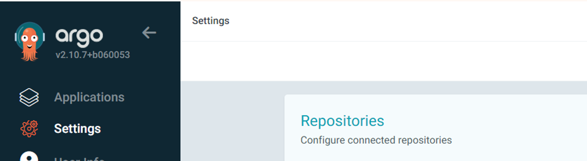
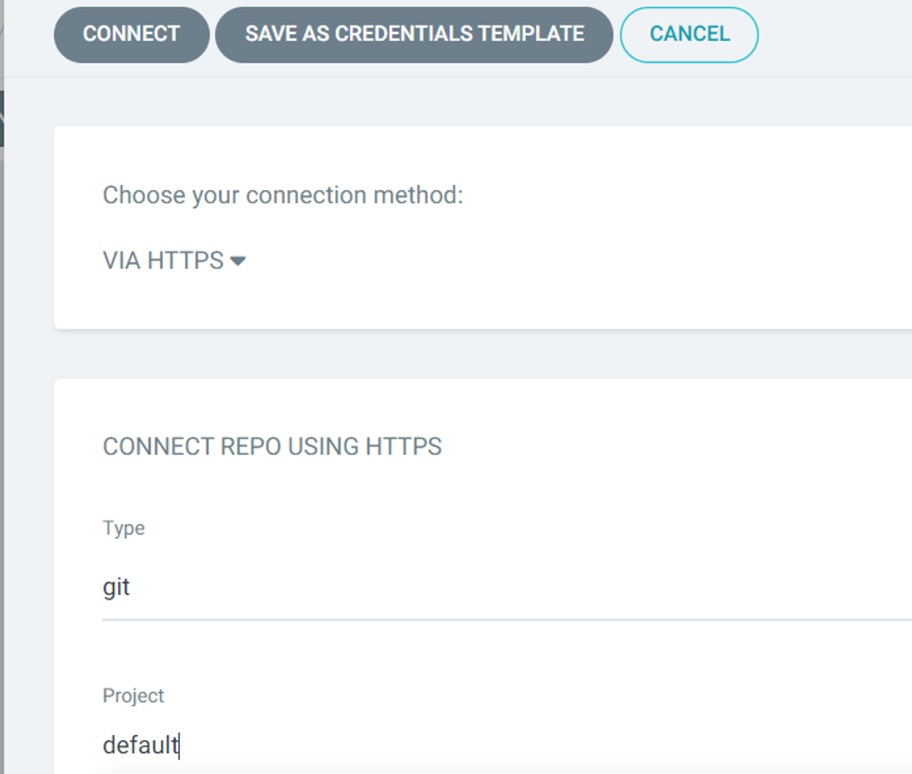
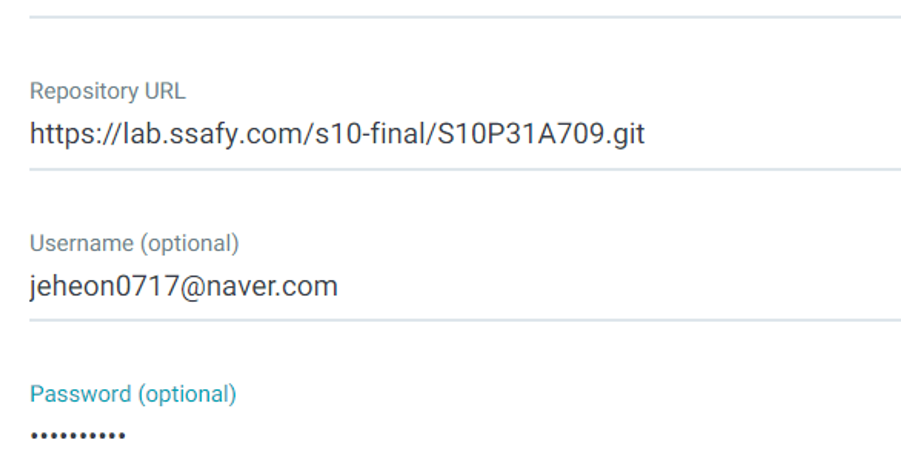

# Nginx Ingress Controller 설치
- Ingress Controller는 클러스터 외부에서 클러스터 내부로 트래픽을 전달하는 역할을 한다. Ingress Controller는 클러스터 외부에서 클러스터 내부로 트래픽을 전달하는 역할을 한다. Ingress Controller는 클러스터 외부에서 클러스터 내부로 트래픽을 전달하는 역할을 한다.
```shell
helm upgrade --install ingress-nginx ingress-nginx \
  --repo https://kubernetes.github.io/ingress-nginx \
  --namespace ingress-nginx --create-namespace
helm install ingress-nginx ingress-nginx/ingress-nginx -n k709  
kubectl get service --namespace ingress-nginx ingress-nginx-controller --output wide --watch
kubectl get svc -n ingress-nginx
```
## ingress.yaml
```yaml
apiVersion: networking.k8s.io/v1
kind: Ingress
metadata:
  name: k709-ingress
  namespace: k709
  annotations:
          #    nginx.ingress.kubernetes.io/rewrite-target: /
    cert-manager.io/cluster-issuer: "k709-prod"
    kubernetes.io/tls-acme: 'true'
    nginx.ingress.kubernetes.io/proxy-read-timeout: "3600"
    nginx.ingress.kubernetes.io/proxy-send-timeout: "3600"
    # nginx.ingress.kubernetes.io/proxy-http-version: "1.1"
    #nginx.ingress.kubernetes.io/use-proxy-protocol: "true"
spec:
  ingressClassName: "nginx"
  tls:
    - hosts:
        - hidebowwow.site
      secretName: hidebowwow-cert
  rules:
    - host: hidebowwow.site
      http:
        paths:
        - path: /
          pathType: Prefix
          backend:
            service:
              name: k709-helm-frontend
              port:
                number: 8081

        - path: /api/game-service/ch/1
          pathType: Prefix
          backend:
            service:
              name: k709-game-service-0
              port:
                number: 8002
        - path: /api/game-service/ch/2
          pathType: Prefix
          backend:
            service:
              name: k709-game-service-1
              port:
                number: 8002

        - path: /api/game-service/ch/3
          pathType: Prefix
          backend:
            service:
              name: k709-game-service-2
              port:
                number: 8002
        - path: /api/game-service/ch/4
          pathType: Prefix
          backend:
            service:
              name: k709-game-service-3
              port:
                number: 8002

        - path: /api/member-service
          pathType: Prefix
          backend:
            service:
              name: k709-member-service
              port:
                number: 8001
```
```shell
kubectl apply -f ingress.yaml
```
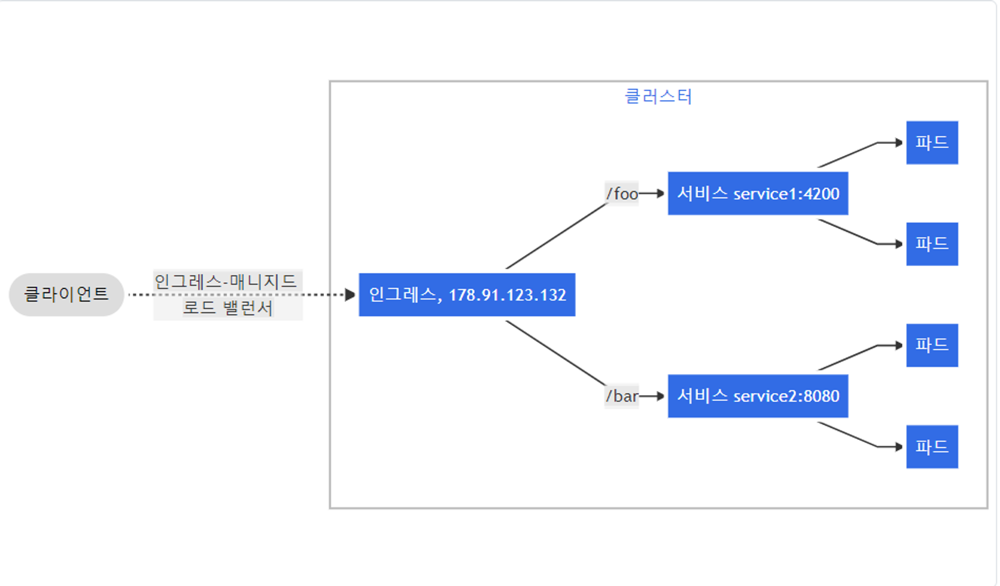

# 프로젝트 배포
## 프로젝트 구조
```shell
+--- kube-manifest
|   +--- .helmignore
|   +--- Chart.yaml
|   +--- charts
|   |   +--- helm-backend
|   |   |   +--- .helmignore
|   |   |   +--- Chart.yaml
|   |   |   +--- charts
|   |   |   |   +--- game-service
|   |   |   |   |   +--- .helmignore
|   |   |   |   |   +--- Chart.yaml
|   |   |   |   |   +--- templates
|   |   |   |   |   |   +--- deployment.yaml
|   |   |   |   |   |   +--- service.yaml
|   |   |   |   |   |   +--- _helpers.tpl
|   |   |   |   |   +--- values.yaml
|   |   |   |   +--- member-service
|   |   |   |   |   +--- .helmignore
|   |   |   |   |   +--- Chart.yaml
|   |   |   |   |   +--- templates
|   |   |   |   |   |   +--- deployment.yaml
|   |   |   |   |   |   +--- service.yaml
|   |   |   |   |   |   +--- _helpers.tpl
|   |   |   |   |   +--- values.yaml
|   |   |   +--- templates
|   |   |   |   +--- helm-backend-game-service.yaml
|   |   |   |   +--- helm-backend-member-service.yaml
|   |   |   +--- values.yaml
|   |   +--- helm-frontend
|   |   |   +--- .helmignore
|   |   |   +--- Chart.yaml
|   |   |   +--- templates
|   |   |   |   +--- deployment.yaml
|   |   |   |   +--- service.yaml
|   |   |   |   +--- _helpers.tpl
|   |   |   +--- values.yaml
|   +--- templates
|   |   +--- helm-backend.yaml
|   |   +--- helm-frontend.yaml
|   +--- values.yaml
```
## kube-manifest
### Chart.yaml
```yaml
apiVersion: v2
name: kube-mainfest
description: A Helm chart for Kubernetes
type: application
version: 0.1.1
appVersion: "1.16.0"
```
### values.yaml
```yaml
spec:
  destination:
    server: https://kubernetes.default.svc
  source:
    repoURL: https://lab.ssafy.com/s10-final/S10P31A709.git
    targetRevision: manifest
```
## templates
### helm-backend.yaml
```yaml
apiVersion: argoproj.io/v1alpha1
kind: Application
metadata:
  name: helm-backend
  namespace: k709
  finalizers:
    - resources-finalizer.argocd.argoproj.io
spec:
  destination:
    namespace: k709
    server: {{ .Values.spec.destination.server }}
  project: default
  source:
    path: kube-manifest/charts/helm-backend
    repoURL: {{ .Values.spec.source.repoURL }}
    targetRevision: {{ .Values.spec.source.targetRevision }}
```
### helm-frontend.yaml
```yaml
apiVersion: argoproj.io/v1alpha1
kind: Application
metadata:
  name: helm-frontend
  namespace: k709
  finalizers:
    - resources-finalizer.argocd.argoproj.io
spec:
  destination:
    namespace: k709
    server: {{ .Values.spec.destination.server }}
  project: default
  source:
    path: kube-manifest/charts/helm-frontend
    repoURL: {{ .Values.spec.source.repoURL }}
    targetRevision: {{ .Values.spec.source.targetRevision }}
```
## Charts
## helm-frontend
### Chart.yaml
```yaml
apiVersion: v2
name: helm-frontend
description: A Helm chart for Kubernetes
type: application
version: 0.1.0
appVersion: "1.16.0"
```
### values.yaml
```yaml
replicaCount: 2

image:
  repository: choichangho514/frontend_test
  pullPolicy: Always
  tag: "latest"

service:
  type: ClusterIP
  port: 8081
  targetPort: 80
env:
  value: 241

nameOverride: ""
fullnameOverride: ""
```
## templates
### _helpers.tpl
```yaml
{{/*
        Expand the name of the chart.
        */}}
        {{- define "frontend.name" -}}
        {{- default .Chart.Name .Values.nameOverride | trunc 63 | trimSuffix "-" -}}
        {{- end -}}

        {{/*
                Create a default fully qualified app name.
                We truncate at 63 chars because some Kubernetes name fields are limited to this (by the DNS naming spec).
                */}}
        {{- define "frontend.fullname" -}}
        {{- if .Values.fullnameOverride -}}
        {{- .Values.fullnameOverride | trunc 63 | trimSuffix "-" -}}
        {{- else -}}
        {{- printf "%s-%s" .Release.Name .Chart.Name | trunc 63 | trimSuffix "-" -}}
        {{- end -}}
        {{- end -}}

        {{/*
                Common labels
                */}}
        {{- define "frontend.labels" -}}
                                       helm.sh/chart: {{ include "frontend.chart" . }}
        {{ include "frontend.name" . }}-app: {{ include "frontend.name" . }}
        {{- end -}}

        {{/*
                Chart name and version
                */}}
        {{- define "frontend.chart" -}}
        {{ printf "%s-%s" .Chart.Name .Chart.Version | replace "+" "_" }}
        {{- end }}
```
### deployment.yaml
```yaml
#deployment.yaml
# jenkins.build.number=123456

apiVersion: apps/v1
kind: Deployment
metadata:
  name: {{ include "frontend.fullname" . }}
spec:
  replicas: {{ .Values.replicaCount }}
  selector:
    matchLabels:
      app: {{ include "frontend.name" . }}
  template:
    metadata:
      labels:
        app: {{ include "frontend.name" . }}
    spec:
      containers:
        - name: {{ .Chart.Name }}
          image: "{{ .Values.image.repository }}:{{ .Values.image.tag }}"
          ports:
            - containerPort: {{ .Values.service.targetPort }}
          imagePullPolicy: {{ .Values.image.pullPolicy }}
          env:
            - name: VERSION
              value: "test1"
```
### service.yaml
```yaml
apiVersion: v1
kind: Service
metadata:
  name: {{ include "frontend.fullname" . }}
spec:
  type: {{ .Values.service.type }}
  ports:
    - port: {{ .Values.service.port }}
      targetPort: {{ .Values.service.targetPort }}
      protocol: TCP
  selector:
    app: {{ include "frontend.name" . }}
```
## helm-backend
### Chart.yaml
```yaml
apiVersion: v2
name: helm-backend
description: A Helm chart for Kubernetes to deploy the backend application
version: 0.1.0
appVersion: "1.0"
```
### values.yaml
```yaml
# jenkins.build.number=

spec:
  destination:
    server: https://kubernetes.default.svc
  source:
    repoURL: https://lab.ssafy.com/s10-final/S10P31A709.git
    targetRevision: manifest
```
## templates
### helm-backend-game-service.yaml
```yaml
apiVersion: argoproj.io/v1alpha1
kind: Application
metadata:
  name: game-service
  namespace: k709
  finalizers:
    - resources-finalizer.argocd.argoproj.io
spec:
  destination:
    namespace: k709
    server: {{ .Values.spec.destination.server }}
  project: default
  source:
    path: kube-manifest/charts/helm-backend/charts/game-service
    repoURL: {{ .Values.spec.source.repoURL }}
    targetRevision: {{ .Values.spec.source.targetRevision }}
```
### helm-backend-member-service.yaml
```yaml
apiVersion: argoproj.io/v1alpha1
kind: Application
metadata:
  name: member-service
  namespace: k709
  finalizers:
    - resources-finalizer.argocd.argoproj.io
spec:
  destination:
    namespace: k709
    server: {{ .Values.spec.destination.server }}
  project: default
  source:
    path: kube-manifest/charts/helm-backend/charts/member-service
    repoURL: {{ .Values.spec.source.repoURL }}
    targetRevision: {{ .Values.spec.source.targetRevision }}
```
## Charts
## game-service
### Chart.yaml
```yaml
apiVersion: v2
name: game-service
description: A Helm chart for Kubernetes
type: application
version: 0.1.0
appVersion: "1.16.0"
```
### values.yaml
```yaml
# jenkins.build.number=
replicaCount: 4

image:
  repository: choichangho514/backend_game_service
  pullPolicy: Always
  tag: "latest"

service:
  type: ClusterIP
  port: 8002
  targetPort: 8002

env:
  value: 235
nameOverride: ""
fullnameOverride: ""
```
## templates
### _helpers.tpl
```yaml
{{/*
Expand the name of the chart.
*/}}
{{- define "game-service.name" -}}
{{- default .Chart.Name .Values.nameOverride | trunc 63 | trimSuffix "-" -}}
{{- end -}}

{{/*
Create a default fully qualified app name.
We truncate at 63 chars because some Kubernetes name fields are limited to this (by the DNS naming spec).
*/}}
{{- define "game-service.fullname" -}}
{{- if .Values.fullnameOverride -}}
{{- .Values.fullnameOverride | trunc 63 | trimSuffix "-" -}}
{{- else -}}
{{- printf "%s-%s" .Release.Name .Chart.Name | trunc 63 | trimSuffix "-" -}}
{{- end -}}
{{- end -}}
```
### deployment.yaml
```yaml
#deployment.yaml
# jenkins.build.number=44444
apiVersion: apps/v1
#kind: Deployment
kind: StatefulSet
metadata:
  name: {{ include "game-service.fullname" . }}
spec:
  replicas: {{ .Values.replicaCount }}
  selector:
    matchLabels:
      app: {{ include "game-service.fullname" . }}
  template:
    metadata:
      labels:
        app: {{ include "game-service.fullname" . }}
    spec:
      containers:
        - name: {{ .Chart.Name }}
          image: "{{ .Values.image.repository }}:{{ .Values.image.tag }}"
          ports:
            - containerPort: {{ .Values.service.targetPort }}
          imagePullPolicy: {{ .Values.image.pullPolicy }}
          env:
            - name: SERVER_DOMAIN
              valueFrom:
                configMapKeyRef:
                  name: domain-config
                  key: SERVER_DOMAIN
            - name: VERSION
              value: "235"
```
### service.yaml
```yaml
#service.yaml
apiVersion: v1
kind: Service
metadata:
  name: k709-game-service-0
spec:
  type: {{ .Values.service.type }}
  ports:
    - port: {{ .Values.service.port }}
      targetPort: {{ .Values.service.targetPort }}
      protocol: TCP
#  clusterIP: None
  selector:
#    app: {{ include "game-service.fullname" . }}
    statefulset.kubernetes.io/pod-name: k709-game-service-0
  sessionAffinity: ClientIP
---
apiVersion: v1
kind: Service
metadata:
  name: k709-game-service-1
spec:
  type: {{ .Values.service.type }}
  ports:
    - port: {{ .Values.service.port }}
      targetPort: {{ .Values.service.targetPort }}
      protocol: TCP
  #  clusterIP: None
  selector:
    #    app: {{ include "game-service.fullname" . }}
    statefulset.kubernetes.io/pod-name: k709-game-service-1
  sessionAffinity: ClientIP
---
apiVersion: v1
kind: Service
metadata:
  name: k709-game-service-2
spec:
  type: {{ .Values.service.type }}
  ports:
    - port: {{ .Values.service.port }}
      targetPort: {{ .Values.service.targetPort }}
      protocol: TCP
  #  clusterIP: None
  selector:
    #    app: {{ include "game-service.fullname" . }}
    statefulset.kubernetes.io/pod-name: k709-game-service-2
  sessionAffinity: ClientIP
---
apiVersion: v1
kind: Service
metadata:
  name: k709-game-service-3
spec:
  type: {{ .Values.service.type }}
  ports:
    - port: {{ .Values.service.port }}
      targetPort: {{ .Values.service.targetPort }}
      protocol: TCP
  #  clusterIP: None
  selector:
    #    app: {{ include "game-service.fullname" . }}
    statefulset.kubernetes.io/pod-name: k709-game-service-3
  sessionAffinity: ClientIP
```
## member-service
### Chart.yaml
```yaml
apiVersion: v2
name: member-service
description: A Helm chart for Kubernetes
type: application
version: 0.1.0
appVersion: "1.16.0"
```
### values.yaml
```yaml
replicaCount: 2

image:
  repository: choichangho514/backend_member_service
  pullPolicy: Always
  tag: "latest"

service:
  type: ClusterIP
  port: 8001
  targetPort: 8001
env:
  value: 241
nameOverride: ""
fullnameOverride: ""
```
## templates
### _helpers.tpl
```yaml
{{/*
Expand the name of the chart.
*/}}
{{- define "member-service.name" -}}
{{- default .Chart.Name .Values.nameOverride | trunc 63 | trimSuffix "-" -}}
{{- end -}}

{{/*
Create a default fully qualified app name.
We truncate at 63 chars because some Kubernetes name fields are limited to this (by the DNS naming spec).
*/}}
{{- define "member-service.fullname" -}}
{{- if .Values.fullnameOverride -}}
{{- .Values.fullnameOverride | trunc 63 | trimSuffix "-" -}}
{{- else -}}
{{- printf "%s-%s" .Release.Name .Chart.Name | trunc 63 | trimSuffix "-" -}}
{{- end -}}
{{- end -}}
```
### deployment.yaml
```yaml
#deployment.yaml
# jenkins.build.number=44444
apiVersion: apps/v1
kind: Deployment
metadata:
  name: {{ include "member-service.fullname" . }}
spec:
  replicas: {{ .Values.replicaCount }}
  selector:
    matchLabels:
      app: {{ include "member-service.fullname" . }}
  template:
    metadata:
      labels:
        app: {{ include "member-service.fullname" . }}
    spec:
      containers:
        - name: {{ .Chart.Name }}
          image: "{{ .Values.image.repository }}:{{ .Values.image.tag }}"
          ports:
            - containerPort: {{ .Values.service.targetPort }}
          imagePullPolicy: {{ .Values.image.pullPolicy }}
          env:
            - name: SERVER_DOMAIN
              valueFrom:
                configMapKeyRef:
                  name: domain-config
                  key: SERVER_DOMAIN
            - name: VERSION
              value: "241"
      imagePullSecrets:
        - name: docker-key
```
### service.yaml
```yaml
#service.yaml
apiVersion: v1
kind: Service
metadata:
  name: {{ include "member-service.fullname" . }}
spec:
  type: {{ .Values.service.type }}
  ports:
    - port: {{ .Values.service.port }}
      targetPort: {{ .Values.service.targetPort }}
      protocol: TCP
  selector:
    app: {{ include "member-service.fullname" . }}
```
